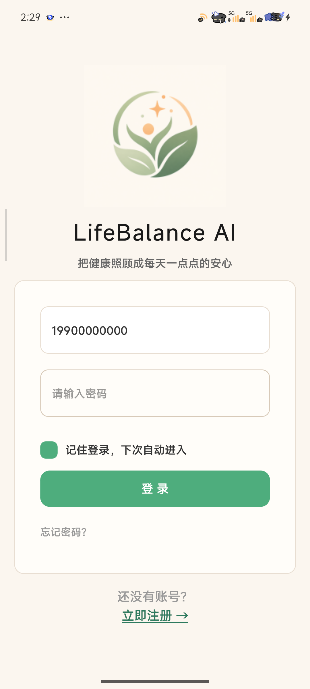
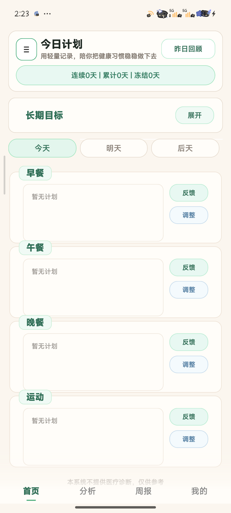
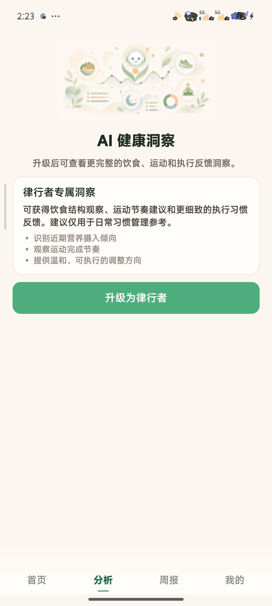
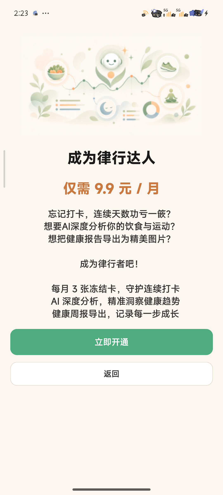
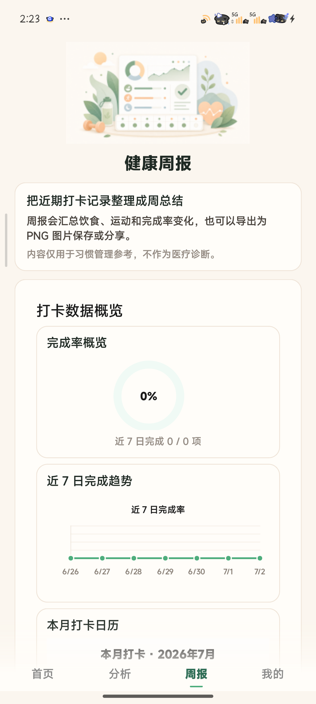
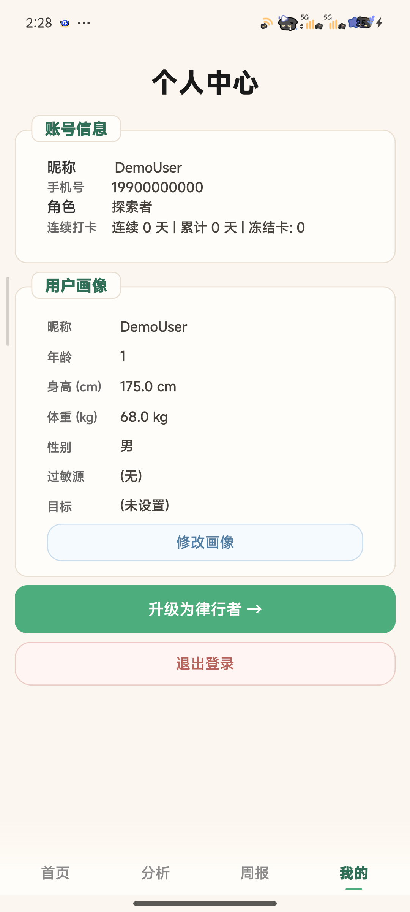
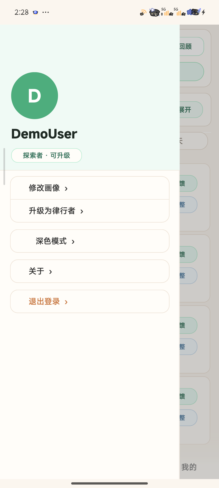
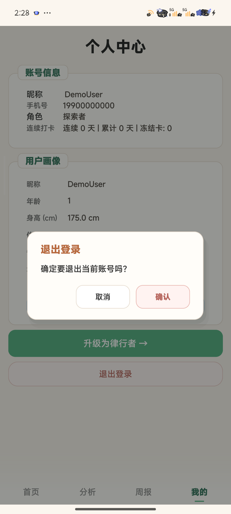

# LifeBalanceAI

LifeBalanceAI 是一个基于 Qt Widgets / C++ 的 AI 健康管理移动端 Demo。项目围绕日常健康管理场景，提供用户登录注册、首页健康计划、餐食与运动记录、AI 饮食分析、健康周报、个人中心和 SQLite 本地数据存储等功能。

本项目适合作为 Qt / C++ 课程设计或移动端 UI 能力展示项目，重点体现 Qt Widgets 应用开发、QSS 全局样式组织、SQLite 数据建模、AI 接口调用、Android 构建适配和完整应用流程设计能力。

## 核心功能

- 用户登录 / 注册：支持账号注册、登录、密码相关流程和本机登录会话。
- 首页健康计划：展示每日饮食、运动、打卡状态和健康计划进度。
- 餐食与运动记录：围绕早餐、午餐、晚餐和运动任务组织每日健康行动。
- AI 饮食分析：根据用户输入和健康目标生成饮食分析结果。
- AI 报告弹窗：通过移动端弹窗承载分析详情、报告内容和操作反馈。
- 健康周报：汇总阶段健康数据，展示趋势、历史记录和健康建议。
- 个人中心：支持个人资料、账号设置、反馈入口、侧边栏和退出确认。
- SQLite 本地数据存储：使用本地数据库保存用户、资料、计划、任务、反馈、报告和会话数据。
- Android 移动端界面适配：包含底部导航、移动端安全区、弹窗滚动和紧凑卡片布局。

## 技术栈

- C++17
- Qt 6.5+ / Qt Widgets
- Qt SQL
- SQLite
- Qt Network
- QSS 全局样式
- CMake
- Qt Test
- Android 构建与部署
- AI 接口调用相关模块：`AIManager`、`airesponseparser`、`deepanalysisservice`、`reportservice`

## 项目结构

```text
LifeBalanceAI/
|-- LifeBalanceAI_demo/
|   |-- android/                    # Android Manifest 与图标资源
|   |-- models/                     # DTO 数据模型
|   |-- resources/                  # QSS、图片、字体、qrc 资源
|   |-- services/                   # 认证、资料、计划、报告、AI 解析等服务层
|   |-- tests/                      # Qt Test 单元测试
|   |-- third_party/android_openssl/ # Android HTTPS 所需 OpenSSL 库
|   |-- main.cpp                    # 应用入口
|   |-- mainwindow.cpp/.h/.ui       # 主界面、页面流程与移动端界面组织
|   |-- databasemanager.cpp/.h      # SQLite 数据库初始化与访问
|   |-- aimanager.cpp/.h            # AI 请求、Key 检查与网络响应处理
|   `-- CMakeLists.txt              # Qt / CMake 构建配置
|-- docs/                           # 项目说明、结构说明和构建文档
|-- screenshots/                    # 展示截图占位与补充清单
|-- tools/                          # 辅助脚本
|-- .gitignore
`-- README.md
```

更完整的结构说明见 [docs/PROJECT_STRUCTURE.md](docs/PROJECT_STRUCTURE.md)。

## 本地运行与构建

推荐环境：

- Qt 6.5 或更新版本
- Qt Creator 11+，或支持 Qt CMake 项目的命令行环境
- CMake 3.19+
- 支持 C++17 的编译器
- 桌面端 Kit：MinGW 64-bit、MSVC 或其他 Qt 支持的桌面 Kit
- Android Kit：Qt Android Clang，真机测试推荐 `arm64-v8a`

Qt Creator 运行方式：

1. 打开 `LifeBalanceAI_demo/CMakeLists.txt`。
2. 选择桌面端或 Android Qt Kit。
3. Configure 项目。
4. Build 并 Run / Deploy。

命令行构建示例：

```powershell
cmake -S LifeBalanceAI_demo -B LifeBalanceAI_demo/build/Desktop-Debug
cmake --build LifeBalanceAI_demo/build/Desktop-Debug
```

AI 功能需要本地环境变量文件。复制示例文件后填写本地 Key：

```powershell
Copy-Item LifeBalanceAI_demo\.env.example LifeBalanceAI_demo\.env
```

真实 API Key、数据库文件、构建产物和本机配置文件不应提交到 Git。

## Android 构建说明

项目包含 Android 包资源目录 `LifeBalanceAI_demo/android/`，并在 CMake 中配置 `QT_ANDROID_PACKAGE_SOURCE_DIR`。Android 端 HTTPS 请求依赖 `LifeBalanceAI_demo/third_party/android_openssl/ssl_3/` 下对应 ABI 的 OpenSSL 动态库。

Android 构建注意事项：

- 在 Qt Creator 中配置 JDK、Android SDK、Android NDK 和 Gradle。
- 选择与设备 ABI 匹配的 Android Kit。
- Debug 包安装后，如需测试 AI 功能，可使用 `tools/android_push_env.ps1` 将本地 `.env` 推送到 App 私有目录。
- 不要提交 APK / AAB 产物，发布 APK 需单独创建 Release 说明。

详细步骤见 [docs/ANDROID_BUILD_GUIDE.md](docs/ANDROID_BUILD_GUIDE.md)。

## 页面截图

当前仓库未提交正式展示截图。本次整理未生成新截图，原因是当前执行环境没有可用的 `cmake` / Qt Kit，无法真实构建并运行应用。

截图占位清单见 [screenshots/README.md](screenshots/README.md)。后续补充真实截图后，可在本节引用：

```markdown








```

## 数据库说明

项目使用 SQLite 作为本地数据库，并通过 `DatabaseManager` 和 Qt SQL 访问。数据库保存用户信息、个人资料、健康计划、每日任务、反馈记录、健康报告、AI 请求日志和本机登录会话等数据。

数据库文件由应用运行时在本地生成，不进入版本库，避免提交个人测试数据或隐私数据。

## 核心实现亮点

- Qt Widgets 移动端界面实现：使用 Widgets 体系组织完整移动端页面和交互流程。
- QSS 全局样式统一：通过 `resources/style.qss` 管理按钮、输入框、卡片、弹窗和导航样式。
- 首页健康计划布局：围绕每日饮食、运动、进度和打卡状态组织信息层级。
- AI 饮食分析页：支持用户输入、AI 请求、结果解析和分析结果展示。
- AI 报告弹窗：使用移动端弹窗承载长文本报告、状态反馈和操作按钮。
- 健康周报页：结合报告数据、趋势图和历史记录展示周期性健康反馈。
- 个人中心与侧边栏：整合资料管理、账号操作、反馈入口和侧边栏导航。
- 移动端弹窗体验：支持加载遮罩、内容滚动、退出确认和深度分析弹窗。
- Android 真机适配：包含 Manifest、图标资源、OpenSSL 动态库和 `.env` 推送脚本。
- SQLite 本地数据组织：通过服务层和 DTO 组织用户、计划、任务、报告等数据流。

## UI 优化亮点

- 移动端安全区适配：关注 Android 顶部/底部安全区域和页面可用高度。
- 底部导航优化：使用底部导航承载首页、分析、周报、个人中心等主要入口。
- 卡片式布局：用紧凑卡片展示任务、报告、资料和反馈内容。
- 低饱和健康类视觉风格：整体风格偏清爽、低饱和，适合健康管理场景。
- 弹窗内容可滚动：长报告、反馈说明和确认弹窗适配小屏阅读。
- 统一视觉规范：首页、分析页、周报页、个人中心使用一致的间距、圆角、字体和按钮层级。

## 后续优化计划

- 完善真实图片识别分析能力。
- 增强健康建议生成质量和可解释性。
- 增加更多数据可视化组件和健康趋势维度。
- 优化 Android 打包、签名、安装和发布体验。
- 增加更多测试数据、演示数据和端到端演示流程。
- 继续拆分大型界面文件，沉淀更清晰的页面组件边界。

## GitHub About 推荐

- Description: `Qt Widgets and C++ mobile health management demo with AI diet analysis, weekly reports, SQLite storage, and Android UI adaptation.`
- Topics: `qt`, `cpp`, `qt-widgets`, `sqlite`, `android`, `health-management`, `mobile-ui`, `qss`, `course-design`, `ai-demo`
